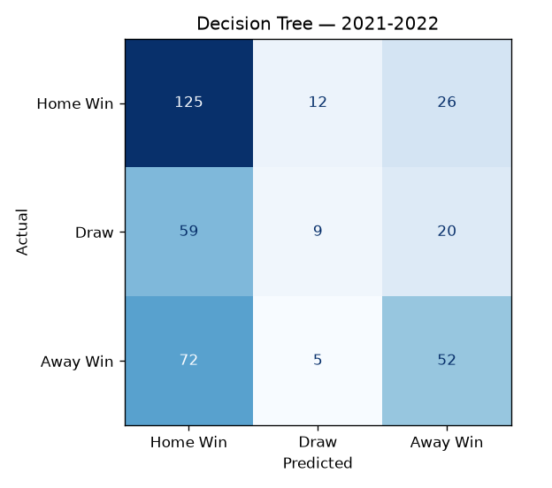
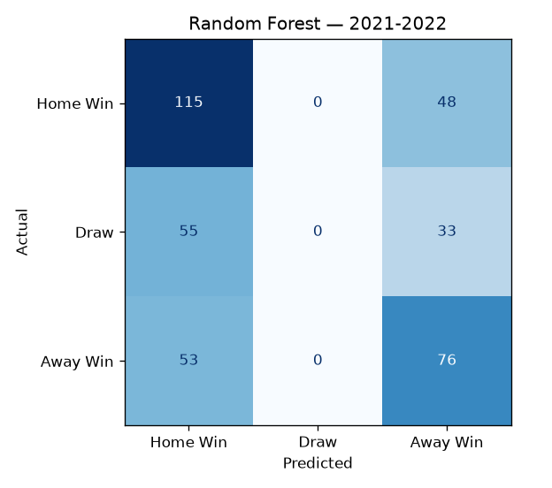
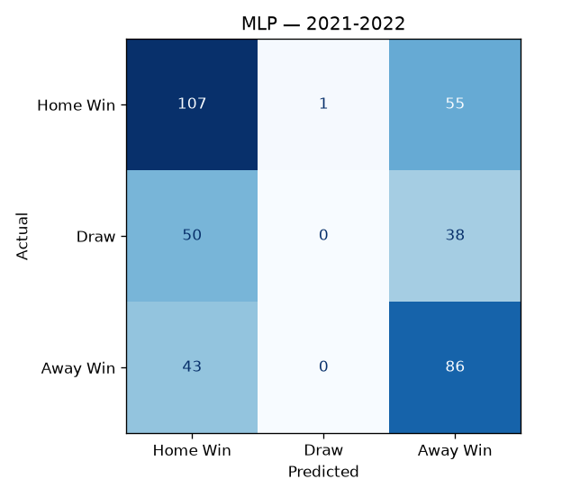

# English Premier League Match Outcome Predictor

Predicts the outcome of Premier League matches (Home Win, Draw, or Away Win)
from engineered, pre-match features, and benchmarks three classifiers
(Decision Tree, Random Forest, MLP) against a majority-class baseline, a random
baseline, and the **bookmaker market** on a fully held-out season.

The emphasis is on honest evaluation: leakage-free features, a temporal
train/test split, fixed random seeds, and metrics reported exactly as measured,
including where the models fail.

## Why I built this

This started as something my friends and I did for fun. We are into the Premier
League, and before matches we would always try to call the results, home win,
draw, or away win. Most of the time we were honestly just guessing. After enough
weekends of arguing over predictions that were barely better than a coin flip, I
got curious whether the guessing was any kind of real skill, or whether we were
basically picking at random between three outcomes.

That question is the whole reason this project exists, and it is why it leans so
hard on baselines. If you guess completely at random you land around 33%, and if
you always pick the home team you get about 43%. Those two numbers are basically
me and my friends on the couch. Everything else here is me trying to see how far
past that a real model can actually get using past results and simple team form,
and being honest about where it still falls apart. The short version is that it
does beat random guessing, it does not beat the betting market, and nobody, not
even the bookmakers, can reliably call a draw.

## Results (test season: 2021-22, 380 matches)

Trained on 2018-19 to 2020-21 (1,140 matches), evaluated on the unseen 2021-22 season.

| Model / baseline | Accuracy | Macro F1 | Home Win F1 | Draw F1 | Away Win F1 | Draw recall |
|---|---|---|---|---|---|---|
| Baseline: Random (uniform) | 0.334 | 0.329 | 0.349 | 0.271 | 0.368 | 0.318 |
| Baseline: Majority class (always Home) | 0.429 | 0.200 | 0.600 | 0.000 | 0.000 | 0.000 |
| **Decision Tree** | 0.489 | 0.404 | 0.597 | 0.158 | 0.458 | 0.102 |
| **Random Forest** | 0.503 | 0.376 | 0.596 | 0.000 | 0.531 | 0.000 |
| **MLP** | 0.508 | 0.383 | 0.590 | 0.000 | 0.558 | 0.000 |
| Reference: Bookmaker (Bet365 implied) | 0.582 | 0.435 | 0.680 | 0.000 | 0.625 | 0.000 |

*(Numbers are produced by `python main.py`; the table is regenerated to
`results/metrics.txt` on every run. Reproducible via `random_state=42`.)*

### What the numbers actually show

- **All three models beat both trivial baselines.** The best, the MLP (50.8%),
  is about 17 points above random (33.4%) and about 8 points above
  always-predict-Home (42.9%). So the engineered features carry real signal.
- **None reach the bookmaker market (58.2%).** This is expected and worth stating
  plainly: Bet365's odds encode information the features don't (lineups,
  injuries, transfers, money flow). The market is the honest ceiling for a
  features-only model, and we land 7 to 9 points below it.
- **Draws are close to unpredictable here.** The Random Forest and MLP predict
  **zero** draws on the test season (Draw recall = 0.000); they collapse the
  hardest class onto Home or Away. Even the bookmaker never makes a draw its
  single most-likely outcome (Draw recall = 0.000). Only the depth-limited
  Decision Tree predicts any draws, and only weakly: recall 0.102 (it catches 9
  of 88 actual draws) at 0.35 precision. This confirms the common hypothesis
  about draws, using the measured figures rather than an assumption.

### Variant: giving the models the betting odds

The models above never see the odds. As an experiment I also trained them with
the Bet365 implied probabilities added as three extra features, to measure how
much the market signal helps. It helps, but not enough to catch the market
itself:

| Setup (best of the three models) | Accuracy | Weighted F1 |
|---|---|---|
| Engineered features only (the main models above) | 0.508 | 0.44 |
| Engineered features plus Bet365 odds | 0.545 | 0.49 |
| The bookmaker market on its own | 0.582 | 0.50 |

The interesting result is that feeding the odds into a model does worse (0.545)
than simply trusting the bookmaker's favorite every week (0.582). The models add
noise to a signal that was already strong on its own. Reproduce with
`python odds_variant.py`.

### Confusion matrices

| Decision Tree | Random Forest | MLP |
|---|---|---|
|  |  |  |

The empty middle (`Draw`) column in the Random Forest and MLP plots is the draw
problem made visual.

## Methodology

### Data
- **Source:** [football-data.co.uk](https://www.football-data.co.uk/englandm.php).
  Free historical Premier League results and betting odds (the `E0` division files).
  Please attribute football-data.co.uk if you reuse the data.
- **Seasons:** train on **2018-19, 2019-20, 2020-21**; test on **2021-22**.
  Each season is a full 380-match campaign (20 teams, home-and-away).
- **Label:** `FTR` (full-time result) maps to `Home Win = 0`, `Draw = 1`, `Away Win = 2`.
- Of the roughly 60 to 106 raw columns per file, only results and Bet365 odds are
  used; the odds feed the bookmaker baseline **only**, never the main models.

### Features (16, all strictly pre-match)
Every feature for a match is computed using **only matches that kicked off
earlier** (each rolling/expanding window is `shift(1)`-ed so a match can never
see its own result). Features are performance aggregates, not team identities,
so promoted or unseen teams need no special handling.

- **Form (last 5, spans seasons):** points-per-game, goals for, goals against,
  and goal difference, for the home and away team.
- **Season-to-date (resets each season):** points-per-game.
- **Venue-specific (season-to-date):** home team's home win rate; away team's
  away win rate.
- **Head-to-head (spans seasons):** home team's win rate in prior meetings with
  this opponent.
- **Difference features:** home minus away for form PPG, form goal difference,
  and season PPG (usually the strongest signals).

Cold-start rows (a team, season, or matchup with no prior history) are left as
`NaN` by the feature builder and imputed with the **training-set median** inside
each model's pipeline, so the split, not the feature code, owns the imputed value.

The no-leakage guarantee is enforced by a test (`tests/test_features.py`):
perturbing a match's score must not change that match's features, but *must*
change a later match involving the same team.

### Models
The split is **temporal by season** (no shuffling across the boundary). Every
model is fronted by a median imputer fit on the training data only; the MLP also
standardises inputs.

| Model | Configuration |
|---|---|
| Decision Tree | `max_depth=6, min_samples_leaf=20, random_state=42` |
| Random Forest | `n_estimators=300, max_depth=10, min_samples_leaf=10, random_state=42` |
| MLP | `StandardScaler` then `MLPClassifier(hidden_layer_sizes=(64,32), max_iter=1000, early_stopping=True, random_state=42)` |

### Baselines
- **Random:** uniform guess across the three classes.
- **Majority class:** always predict the most common training outcome (Home Win).
- **Bookmaker (Bet365):** invert the H/D/A odds to implied probabilities,
  normalise out the overround, and take the argmax. A strong real-world reference.

## Project structure

```
.
├── data/                     # season CSVs (football-data.co.uk E0 exports)
│   ├── 2018-2019.csv         # \
│   ├── 2019-2020.csv         #  } training seasons
│   ├── 2020-2021.csv         # /
│   └── 2021-2022.csv         # held-out test season
├── src/
│   ├── data.py               # load, parse, concat, label-encode
│   ├── features.py           # leakage-free feature engineering
│   └── evaluate.py           # baselines, reports, confusion-matrix plots
├── tests/
│   └── test_features.py      # no-leakage + shape tests
├── results/                  # generated metrics.txt + confusion PNGs
├── main.py                   # orchestrates the full pipeline
├── odds_variant.py           # experiment: models with vs without betting odds
└── requirements.txt
```

## Setup and run

```bash
python3 -m venv venv
source venv/bin/activate
pip install -r requirements.txt

# reproduce the reported results
python main.py          # prints reports + writes results/
python odds_variant.py  # optional: compare models with vs without odds
pytest -q               # runs the leakage/shape tests
```

## Limitations and possible extensions
- Features are team-performance only. Adding lineup or injury data, expected
  goals (xG), or rest days would be the natural way to close the gap to the market.
- The draw class is barely learnable from these features. Approaches worth trying
  (and reporting honestly) include `class_weight="balanced"`, focal-style
  reweighting, or reframing as an ordinal/regression problem on goal difference.
- Only one held-out season is evaluated. Walk-forward or leave-one-season-out
  cross-validation would tighten the estimates.
